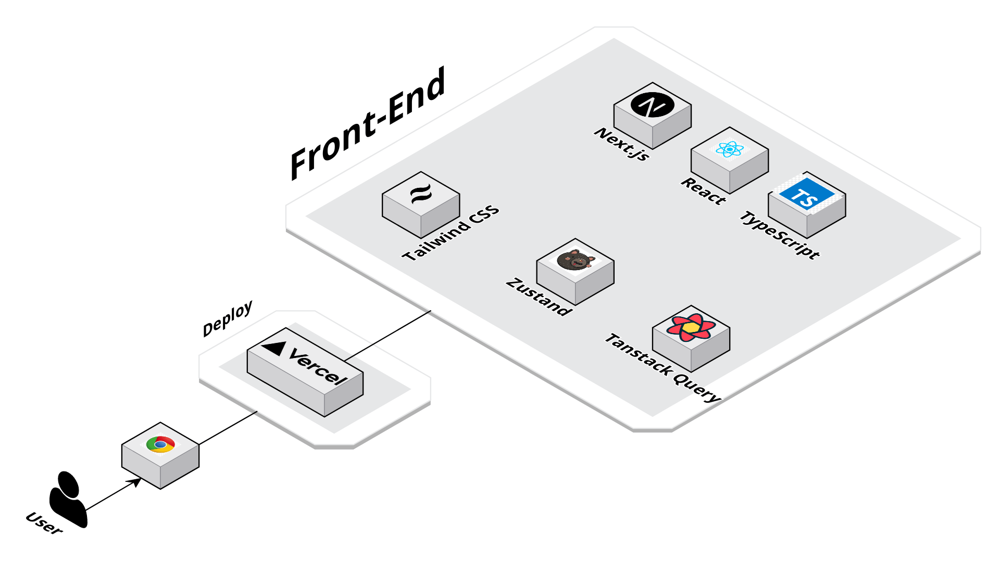

# Spaghetti Coding Club

🔗 [SCC 바로가기](https://www.spaghetticoding.shop)

## <b>프로젝트 소개</b>

다수의 수강생들을 대상으로 교육서비스를 제공하는 업체에서 여러 수강생들과 교육 프로그램을 편리하게 관리하기 위한 웹 어플리케이션을 개발함.

백엔드 레포지토리는 [여기](https://github.com/Kim-s-Crew/SpaghettiCodingClub-BE)서 확인 가능합니다.

## 주요기능

### ✅ 회원가입

- 관리자/수강생 분리하여 회원가입
- 모든 이메일에 대한 인증 절차 내장

### ✅ 트랙 관리

- 신규 트랙 생성
- 기존 트랙 수정
- 트랙명으로 검색 기능
- 마커, 장소 목록 클릭 시 장소 상세 페이지로 이동

### ✅ 수강생 관리

- 각 트랙별로 수강생 검색 가능
- 각 수강생 별로 학습/배경/관계 등의 logging 기능

### ✅ 주차 관리

- 각 트랙 내에서 여러 주차를 생성하고 관리 가능

### ✅ 공지사항

- 각 트랙별로 분리된 공지사항 작성 및 열람 기능

### ✅ 팀 빌딩(개발중)

- 클릭 한번으로 신규 팀을 생성하고
- Drag n Drop 으로 편리하게 수강생을 끌어다 팀을 편성하거나 수정할 수 있음

## <b>개발 일정</b>

2024.03 ~ 2024.06

## <b>서비스 아키텍쳐</b>

## <b>사용 기술 스택</b>

 

## <b>버전 관리</b>

## 협업툴

## <b>팀원</b>

| 팀원   | 블로그                            | GitHub                        |
| ------ | --------------------------------- | ----------------------------- |
| 김래준 | https://velog.io/@laejunkim/posts | https://github.com/Laejun-Kim |
| 김미희 | https://velog.io/@jetiiin/posts   | https://github.com/mi-hee-k   |
